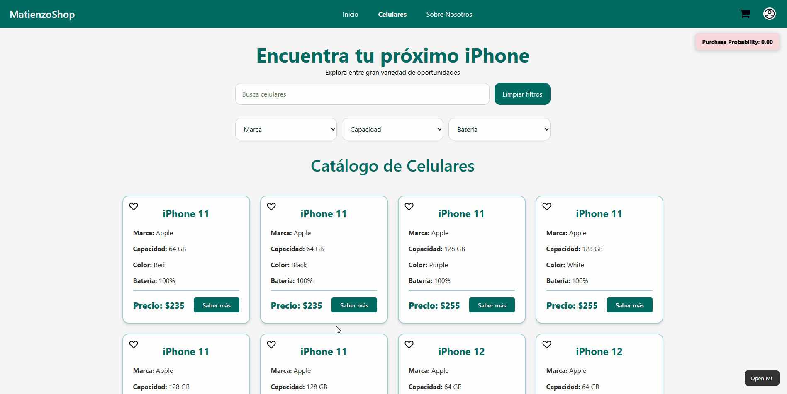

# 🛒 ML-Driven E-commerce Platform with Real-Time Purchase Intent Prediction

End-to-end fullstack e-commerce system that predicts user purchase intent in real time using behavioral data and a microservices architecture.

---

<p align="center">
  
</p>

---

## 🚀 Overview

This project is an end-to-end fullstack e-commerce platform enhanced with a real-time Machine Learning pipeline that predicts user purchase intent based on live interaction data.

It simulates a production-like environment where user behavior is continuously tracked, processed, and transformed into predictive insights that dynamically update the user interface.

Unlike traditional e-commerce applications, this system integrates:

- Real-time behavioral tracking
- Live ML inference
- Microservices-based architecture
- Production-oriented design principles

---

## ⭐ Key Highlights

- 🧠 **Real-time purchase intent prediction**
- ⚡ **Dynamic feature engineering** from live session data
- 🧱 **Microservices-based architecture** (decoupled & scalable)
- 🔄 **Continuous prediction updates** during user interaction
- 🐳 **Fully containerized environment** with Docker
- 📊 **End-to-end ML pipeline:** data generation → training → prediction → UI

---

## 🏗️ System Architecture

The system is designed using a **microservices-oriented architecture**, separating concerns into independent, scalable components:

#### **Frontend (React + Vite)**
- Handles user interaction and UI rendering.
- Displays product catalog and dynamic filters.
- Real-time visualization of ML predictions.

#### **Backend (Spring Boot - Java)**
- Business logic & session management.
- Tracks user session events (user behavior).
- Builds and maintains session state.
- Communicates with the ML service.

#### **ML Service (FastAPI - Python)**
- Receives session-level behavioral data.
- Performs dynamic feature engineering.
- Executes model inference.
- Returns purchase probability.

#### **Database (PostgreSQL)**
- Stores product catalog.
- Session and event data persistence.
- Acts as system source of truth.

#### **DevOps**
- Docker & Docker Compose for orchestration.
- Ensures reproducibility and environment consistency.

---

## 🔄 Real-Time Prediction Flow

1. User interacts with the platform (e.g., view product, add to cart, etc.).
2. Backend captures and updates session state.
3. Session data is accumulated and sent to the ML service.
4. Features are dynamically constructed from behavioral patterns.
5. Model computes purchase probability.
6. Prediction is returned to the backend.
7. Result is logged and visualized in the UI.

---

## 🤖 Machine Learning Pipeline

### 🧪 Offline Model Development

#### 1. Synthetic dataset generation to simulate user behavior
- Simulates realistic user behavior:
  - Browsing
  - Cart interactions
  - Search patterns
- Includes temporal dynamics and session-based logic.

#### 2. Feature engineering based on session-level patterns
Features are built at session level:

* **Behavioral Features**: `cart_view_ratio`, `view_to_cart_transition_rate`, `cart_cycles`
* **Temporal Features**: `session_duration_seconds`, `time_to_first_cart`
* **Engagement Features**: `events_count`, `repeat_views`

#### 3. Model training and evaluation
Two models were evaluated:

| Model        | AUC   | Accuracy |
|--------------|-------|----------|
| RandomForest | 0.889 |   0.80   |
| XGBoost      | 0.897 |   0.81   |

**Selected Model: Random Forest**

Although XGBoost performed slightly better, Random Forest was selected due to:
- Comparable Performance
- Greater Stability
- Better interpretability

### 🔍 Key Features (Feature Importance)
The model relies primarily on behavioral signals:
- Cart view ratio
- Time to first cart
- View-to-cart transition rate
- Repeat views
- Add-to-cart count
- Cart removal ratio
- Session duration
- Total events

> 👉 **Insight:** Purchase intent is driven more by interaction patterns and timing than isolated actions.

---

### ⚡ Online Inference Pipeline
The ML system is deployed as an independent microservice that: 

1. **Receives session event data** from the backend.
2. **Builds feature vectors** dynamically.
3. **Applies the trained model**.
4. **Returns a probability score** in real time.

This prediction is continuously updated as user behavior evolves.

---

## 🖥️ Application UI

*[Insert UI Screenshots / Layouts here]*

---

## 🧪 Tech Stack

* **Frontend:** React, Vite
* **Backend:** Java, Spring Boot
* **Machine Learning:** Python, FastAPI, Scikit-learn, Pandas
* **Database:** PostgreSQL
* **DevOps:** Docker, Docker Compose

---

## 📁 Project Structure

```text
ecommerce-ml-system/
│
├── frontend/
├── backend/
├── ml-service/
│
├── docker-compose.yml
└── README.md
```

---

## 🚀 How to Run (Local Development)

### Prerequisites
- [Docker](https://docs.docker.com/get-docker/) and Docker Compose installed on your machine.
- Git

### 1. Clone the repository
```bash
git clone https://github.com/FacuuC/Ecommerce-ML.git
cd ecommerce-ml
```

### 2. Setup Environment Variables (Important)
The backend requires a JWT secret to handle authentication, and the Docker Compose file relies on an `.env` file. Create your local environment file from the provided template:

* For **Linux/macOS**:
  ```bash
  cp .env.template .env
  ```
* For **Windows (Command Prompt)**:
  ```cmd
  copy .env.template .env
  ```
> **Note:** Open the newly created `.env` file and set a random secure string for `JWT_SECRET` before proceeding.

### 3. Build and run
Start the entire microservices architecture:
```bash
docker-compose up --build
```
*(The first run might take a few minutes as it downloads the base images and Maven compiles the Spring Boot backend).*

### 4. Access the Services
Once all containers are up and running, the platform is ready at: 
- 🌐 **Frontend (UI):** [http://localhost:5173](http://localhost:5173)
- ⚙️ **Backend API:** [http://localhost:8080](http://localhost:8080)
- 🧠 **ML Service API:** [http://localhost:8000](http://localhost:8000)
- 🗄️ **Database:** `localhost:5433` *(Mapped to 5433 on the host to prevent conflicts with local PostgreSQL installations. Credentials match the `.env` file).*

---

## 💡 Developer Notes

* **Hot Reloading:** Both the Frontend (Vite) and ML Service (FastAPI) are configured with volume mounts and auto-reloading (`CHOKIDAR_USEPOLLING=true` and `--reload`). Any changes made to the React or Python code will reflect instantly without restarting containers.
* **Backend Rebuilds:** The Spring Boot service uses a multi-stage build. If you modify the Java source code, you will need to restart and rebuild that specific container to see the changes.

---

## 📊 Why This Project Matters

Most Machine Learning projects stop at model training. This project goes further by demonstrating:

- ✅ Integration of ML into a **live application**
- ✅ Handling real-time inference under continuous user interaction
- ✅ Microservices communication in a production-like setup
- ✅ End-to-end system design combining backend + ML + frontend

---

## 🧠 Key Learnings

- Bridging the gap between ML models and production systems.
- Building dynamic feature engineering pipelines.
- Designing and coordinating microservices architecture.
- Handling real-time data flows and session state.
- Managing inter-service communication and latency considerations.

---

## 📌 Future Improvements
- [ ] MLOps pipeline for automated retraining
- [ ] Online learning / streaming-based updates
- [ ] Replace synthetic data with real-world datasets
- [ ] Cloud deployment (AWS / GCP)
- [ ] Improve user authentication & personalization
- [ ] Implement event streaming (Kafka / RabbitMQ)
- [ ] Model monitoring and drift detection

---

## 👨‍💻 Author

**Facundo Costamagna** AI & Robotics Student | ML & Backend Developer  
- **GitHub:** [https://github.com/FacuuC](https://github.com/FacuuC)
- **LinkedIn:** [https://www.linkedin.com/in/facucostamagna](https://www.linkedin.com/in/facucostamagna)
